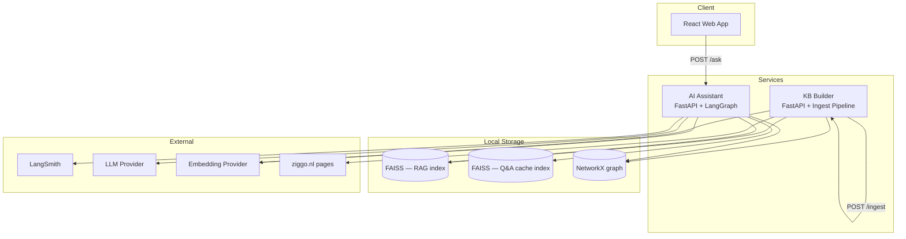
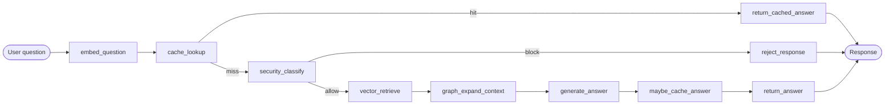
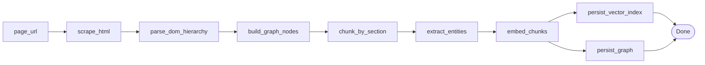
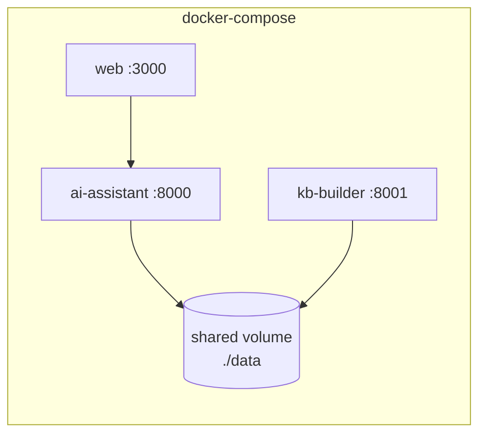
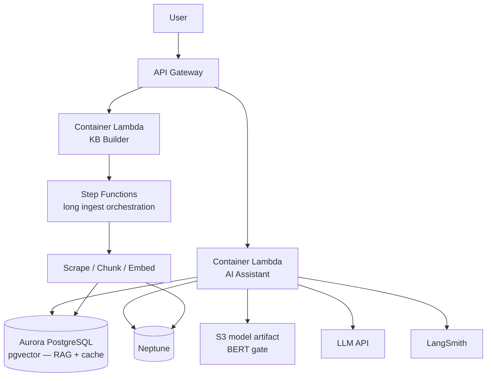

# Architecture — VodafoneZiggo RAG Assistant

This document describes the system architecture for the Ziggo customer-facing AI assistant. It covers the local development setup, service boundaries, data stores, and the target AWS deployment model.

## 1. Goals

| Goal | How we address it |
|------|-------------------|
| Assignment requirements | RAG over Ziggo web content, LangGraph orchestration, FastAPI, Docker Compose |
| Graph RAG showcase | Knowledge graph models page structure, sections, chunks, and entities |
| Enterprise architecture | CDK stacks, dual-service design, clear local → AWS storage swap |
| Cost & safety | Separate Q&A cache index; BERT gate before expensive RAG path |
| Knowledge engineering | KB-builder with per-page re-ingest and heading-aware graph structure |

## 2. High-level system view



## 3. Repository layout

```
vziggo-rag/
├── apps/
│   └── web/                    # React chat UI (local testing)
├── infra/                      # AWS CDK (synth only — no deploy required)
├── services/
│   ├── ai-assistant/           # Query path: cache → security → RAG
│   │   ├── app/
│   │   │   ├── api/
│   │   │   ├── graph/          # LangGraph workflow
│   │   │   ├── cache/
│   │   │   ├── security/       # BERT gate
│   │   │   └── storage/        # VectorStore, GraphStore, CacheStore
│   │   └── Dockerfile
│   └── kb-builder/             # Write path: scrape → structure → embed
│       ├── app/
│       │   ├── api/
│       │   ├── scrape/
│       │   ├── structure/      # DOM → graph nodes
│       │   ├── chunk/
│       │   ├── embed/
│       │   └── storage/
│       └── Dockerfile
├── packages/
│   └── api-contracts/          # Optional: shared API types for web
├── data/                       # Serialized FAISS indexes + graph snapshots
├── docker-compose.yml
├── turbo.json                  # Orchestrates infra + web (not Python)
├── ARCHITECTURE.md
├── IMPLEMENTATION_PLAN.md
└── README.md
```

**Orchestration split**

- **Turborepo** — `infra/` CDK build/synth, `apps/web` lint/build.
- **Docker Compose** — Python services, shared volumes for `data/`, inter-service networking.

## 4. Services

### 4.1 AI Assistant (query path)

**Responsibility:** Accept customer questions, apply cache and security checks, run graph-augmented RAG, return answers.

| Endpoint | Method | Description |
|----------|--------|-------------|
| `/ask` | POST | Question in → answer out (JSON) |
| `/health` | GET | Liveness check |

**LangGraph workflow nodes**



| Node | Input | Processing | Output |
|------|-------|------------|--------|
| `embed_question` | User question string | Embed via embedding model | Question vector |
| `cache_lookup` | Question vector | Similarity search in **cache index** (separate FAISS) | Cache hit + answer, or miss |
| `security_classify` | User question | BERT / zero-shot classifier | `allow` \| `block` + reason |
| `vector_retrieve` | Question vector | Top-k similarity in **RAG index** | Chunk IDs + scores |
| `graph_expand_context` | Chunk IDs | NetworkX traversal: parent section, entities, adjacent chunks | Enriched context set |
| `generate_answer` | Question + context | LLM with system prompt (tone, safety, cite context) | Draft answer |
| `maybe_cache_answer` | Question, answer, confidence | Write to cache if confidence ≥ threshold | Updated cache (optional) |
| `return_cached_answer` | Cached record | Format customer-facing response | Final JSON |
| `reject_response` | Block reason | Safe refusal message | Final JSON |

**Low-confidence / empty retrieval**

- If vector retrieve returns no chunks above threshold → route to `reject_response` or a dedicated `cannot_answer` node with a clear message.
- Optional future node: `reformulate_query` before a second retrieve attempt.

**Observability:** LangSmith traces every node transition and LLM call.

### 4.2 KB Builder (ingest path)

**Responsibility:** Scrape Ziggo pages, build graph structure, chunk, embed, persist to shared storage.

| Endpoint | Method | Description |
|----------|--------|-------------|
| `/ingest` | POST | Re-ingest a single page by URL (`page_url` in body) |
| `/ingest/batch` | POST | Ingest multiple configured pages (optional) |
| `/status` | GET | Last ingest status per page |
| `/health` | GET | Liveness check |

**Ingest pipeline**



**Re-ingest semantics**

- Each page has a stable `page_id` (derived from URL).
- Re-ingest **replaces** the page subgraph and associated chunk vectors (delete-then-insert).
- Other pages in the KB are untouched.

**Source scope:** 5–10 Ziggo product/service pages (e.g. internet, TV, Ziggo GO).

## 5. Knowledge graph schema

NetworkX locally; Amazon Neptune (Gremlin) in AWS — both behind a `GraphStore` interface.

### 5.1 Node types

| Label | Key properties | Description |
|-------|----------------|-------------|
| `Page` | `page_id`, `url`, `title`, `scraped_at` | One scraped ziggo.nl page |
| `Section` | `section_id`, `heading`, `level` | DOM heading block (h1–h4) |
| `Chunk` | `chunk_id`, `text`, `token_count` | Retrieval unit within a section |
| `Entity` | `entity_id`, `name`, `type` | Product/feature mention (e.g. "Ziggo GO") |

### 5.2 Edge types

| Edge | From → To | Purpose |
|------|-----------|---------|
| `HAS_SECTION` | Page → Section | Page structure |
| `HAS_CHUNK` | Section → Chunk | Section contains chunks |
| `NEXT` | Chunk → Chunk | Reading order within section |
| `MENTIONS` | Chunk → Entity | Entity extraction link |
| `RELATED_TO` | Entity → Entity | Cross-page / cross-product relationships |

### 5.3 Graph-augmented retrieval

1. Vector search returns top-k `Chunk` nodes.
2. Graph expansion adds:
   - Parent `Section` (heading context)
   - `NEXT` adjacent chunks (continuity)
   - `MENTIONS` → `RELATED_TO` entities (cross-link context)
3. Dedupe, rank by relevance, trim to context window budget.

## 6. Storage layer

### 6.1 Abstractions

All services depend on protocols, not concrete backends:

```python
# Conceptual interfaces (implemented in services/*/app/storage/)

class VectorStore(Protocol):
    def upsert_chunks(self, chunks: list[ChunkRecord]) -> None: ...
    def delete_by_page(self, page_id: str) -> None: ...
    def search(self, query_vector: list[float], top_k: int) -> list[ScoredChunk]: ...

class CacheStore(Protocol):
    def lookup(self, query_vector: list[float], threshold: float) -> CacheHit | None: ...
    def put(self, question: str, answer: str, vector: list[float]) -> None: ...

class GraphStore(Protocol):
    def upsert_page_subgraph(self, page_id: str, nodes, edges) -> None: ...
    def delete_page(self, page_id: str) -> None: ...
    def expand_from_chunks(self, chunk_ids: list[str]) -> GraphContext: ...
    def save(self, path: str) -> None: ...
    def load(self, path: str) -> None: ...
```

### 6.2 Local vs AWS

| Concern | Local | AWS |
|---------|-------|-----|
| RAG vectors | FAISS index on disk (`data/rag.index`) | Aurora PostgreSQL + pgvector |
| Q&A cache | Separate FAISS index (`data/cache.index`) | Aurora pgvector (separate table) |
| Knowledge graph | NetworkX → serialized (`data/graph.pkl` / JSON) | Amazon Neptune |
| Graph queries | NetworkX traversal | Gremlin (same `GraphStore` contract) |
| LLM / embeddings | OpenAI or Hugging Face (env-configured) | Same providers via VPC endpoints / secrets |
| Observability | LangSmith | LangSmith (env vars in Lambda/ECS) |

### 6.3 Committed data

- `data/` holds **sample** serialized indexes and graph for clone-and-run.
- Document `make ingest` (or `POST /ingest`) to regenerate after scraping.
- Keep artifacts small (5–10 pages); add `data/*.index` to `.gitignore` if binaries grow.

## 7. Cache index design

**Why separate from RAG index**

- Different lifecycle (Q&A pairs vs document chunks).
- Different similarity thresholds and TTL policies.
- Avoids polluting retrieval context with past answers.

**Cache record**

```json
{
  "question": "What is Ziggo GO?",
  "answer": "...",
  "embedding": [...],
  "created_at": "ISO-8601",
  "source": "auto | seed"
}
```

**Lookup:** cosine similarity ≥ configurable threshold (e.g. 0.92) → return cached answer without LLM call.

**Seed data:** ship 5–10 canonical Q&As in `data/qa_cache_seed.json` for demo cache hits.

## 8. Security gate (BERT)

**Role:** Route before expensive RAG — not a replacement for LLM safety.

| Label | Action |
|-------|--------|
| `product_question` | Continue to RAG |
| `off_topic` | Polite refusal |
| `harmful` / `toxic` | Block with safe message |

**Implementation (local):** pretrained model (e.g. `unitary/toxic-bert`) or small zero-shot classifier — no custom training required for the assignment.

**AWS:** model artifact in S3, loaded in container Lambda cold start; SageMaker endpoint noted as production alternative in README.

## 9. Local runtime (Docker Compose)



- Both Python services mount `./data` read/write.
- KB-builder writes indexes; AI-assistant reads them (restart or hot-reload on ingest complete).
- Web app proxies or calls `ai-assistant` directly.

## 10. AWS target architecture (CDK — illustrative)



### 10.1 CDK stack split (`infra/`)

| Stack | Resources |
|-------|-----------|
| `NetworkStack` | VPC, subnets, security groups |
| `DataStack` | Aurora (pgvector), Neptune cluster |
| `ApiStack` | API Gateway, AI-assistant Lambda, KB-builder Lambda |
| `IngestStack` | Step Functions state machine, EventBridge schedule (optional) |
| `ObservabilityStack` | CloudWatch logs, optional X-Ray |

### 10.2 Security considerations (AWS)

- API Gateway: throttling, API keys or Cognito for demo; WAF for production.
- Secrets Manager for LLM/embedding API keys.
- Aurora and Neptune in private subnets; Lambda in VPC with least-privilege SGs.
- S3 bucket policies for model artifacts and ingest staging.
- No PII stored in cache without retention policy (document in README).

## 11. Technology choices

| Component | Choice | Rationale |
|-----------|--------|-----------|
| Embeddings | OpenAI `text-embedding-3-small` (or HF `all-MiniLM-L6-v2`) | Quality/cost balance; HF option for offline |
| Vector store (local) | FAISS | Fast, no extra service, easy serialize to `data/` |
| Vector store (AWS) | Aurora pgvector | Managed, SQL ecosystem, dual table for RAG + cache |
| Graph (local) | NetworkX | Simple, serializable, fast iteration |
| Graph (AWS) | Neptune | Managed graph, Gremlin, fits entity/structure model |
| Orchestration | LangGraph | Assignment requirement; explicit node/edge observability |
| API | FastAPI | Async, OpenAPI docs, lightweight |
| Frontend | React | Local chat testing (not assignment-critical) |
| IaC | AWS CDK (TypeScript) | Enterprise showcase; matches turbo infra pipeline |
| Observability | LangSmith | First-class LangGraph tracing |

## 12. API contracts (summary)

### POST `/ask` (AI Assistant)

**Request**
```json
{ "question": "What TV packages does Ziggo offer?" }
```

**Response**
```json
{
  "answer": "...",
  "source": "cache | rag",
  "confidence": 0.95,
  "blocked": false
}
```

### POST `/ingest` (KB Builder)

**Request**
```json
{ "page_url": "https://www.ziggo.nl/internet" }
```

**Response**
```json
{
  "page_id": "internet",
  "chunks_created": 42,
  "entities_extracted": 8,
  "status": "success"
}
```

---

*See [IMPLEMENTATION_PLAN.md](./IMPLEMENTATION_PLAN.md) for phased build order and task checklist.*
