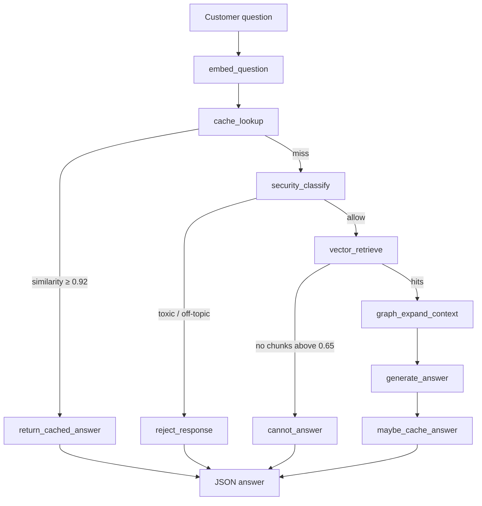
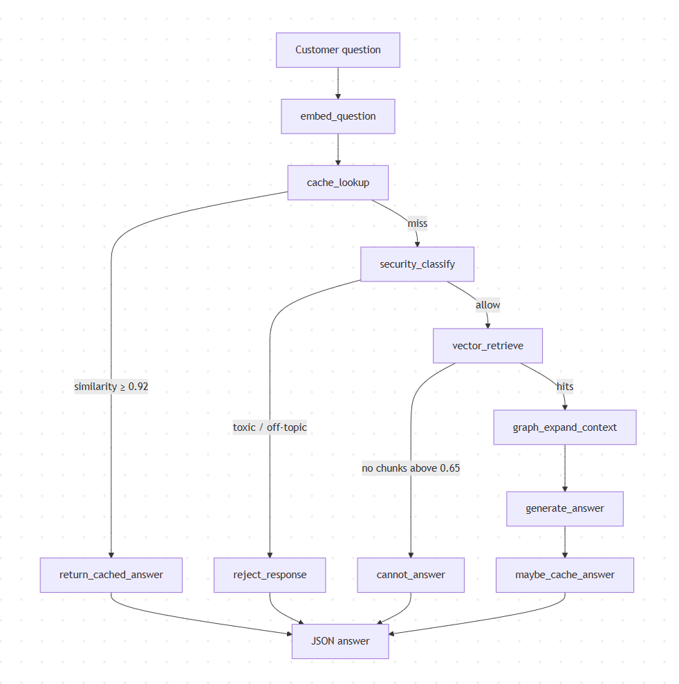
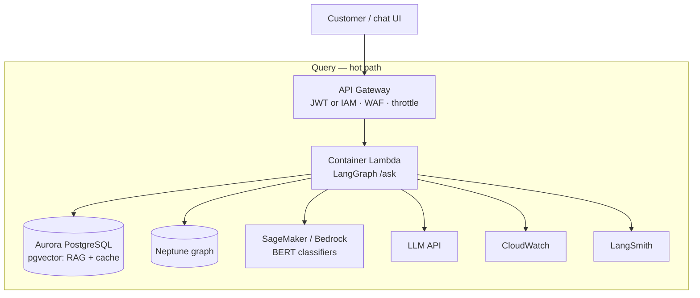
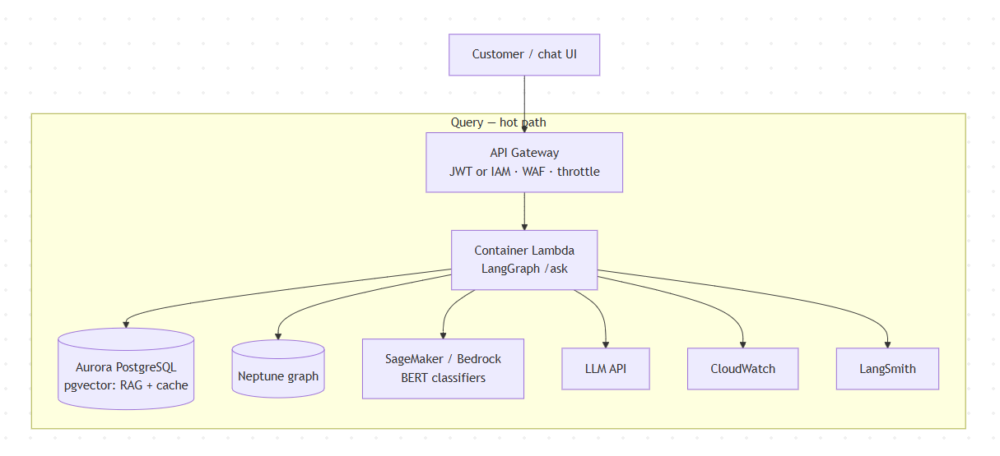

# Ziggo customer AI assistant

A customer-facing RAG assistant for Ziggo product questions (internet, TV, Ziggo GO), orchestrated with **LangGraph**.

Clone, `docker compose up --build`, `POST /ask` — answers come from scraped ziggo.nl pages, not from the model’s general knowledge.

This README is the design document. It covers what the assignment asked for, what I added on top (and why), how to run it locally, and how the same design would look on AWS.

---

## Assignment vs what I added

| Assignment asked | In this repo |
|------------------|--------------|
| Scrape a Ziggo page, clean, chunk | `kb-builder` — heading-aware chunks across **30** ziggo.nl pages |
| Embeddings + local vector store | OpenAI `text-embedding-3-small` + **FAISS** (files in `data/`) |
| LangGraph: question → retrieve → LLM → answer | `services/ai-assistant/app/graph.py` |
| Empty / low-confidence retrieval | `cannot_answer` node |
| FastAPI `POST /ask` | `app/main.py` |
| Docker Compose | `docker-compose.yml` |
| Architecture + AWS view | this README |

**Added on top** (not required, included to show production thinking):

1. **Semantic Q&A cache** — skip the LLM on near-duplicate questions (cost + latency).
2. **BERT security gate** — local classifiers for toxic / off-topic *before* RAG (not every step needs a frontier LLM).
3. **Knowledge graph expansion** — retrieve chunks, then walk Page → Section → Chunk → Entity for grounded context.
4. **Observability** — LangSmith traces on every node; CloudWatch in the AWS target.
5. **Monorepo + CDK** — application and infra in one repo.

---

## Quick start

```bash
cp .env.example .env          # set OPENAI_API_KEY and LANGSMITH_API_KEY
docker compose up --build

curl http://localhost:8000/health
curl -X POST http://localhost:8000/ask \
  -H "Content-Type: application/json" \
  -d '{"question": "What is Ziggo GO?"}'

# Chat UI
open http://localhost:3000
```

First Compose start of `ai-assistant` can take ~1–2 minutes: BERT weights are baked into the image, then loaded at process start together with FAISS and the graph.

If `data/rag.faiss` is missing, ingest first (needs the API key; ~10 minutes):

```bash
pip install -e packages/kb-store
cd services/kb-builder && pip install -r requirements.txt
DATA_DIR=../../data python scripts/run_ingest_all.py --ziggo-only
```

---

## Repository map — important files

```
vziggo-rag/
├── docker-compose.yml                 # FastAPI + web, shared ./data volume
├── .env.example
│
├── services/ai-assistant/             # ★ query path (assignment core)
│   ├── Dockerfile                     # installs kb-store; downloads BERT at build
│   ├── app/main.py                    # FastAPI, CORS, lifespan, POST /ask
│   ├── app/config.py                  # thresholds, models, DATA_DIR
│   ├── app/graph.py                   # LangGraph wiring + AskRequest/AskResponse
│   ├── app/nodes.py                   # every node (embed, cache, security, RAG)
│   ├── app/cache/                     # semantic Q&A cache (seed + write-back)
│   ├── app/llm/                       # chat model + customer-facing prompts
│   └── app/security/                  # BERT toxic + off-topic classifiers
│
├── services/kb-builder/               # write path: scrape → chunk → index
│   ├── Dockerfile
│   └── app/pipeline/graph.py          # ingest LangGraph
│
├── packages/kb-store/                 # shared FAISS + NetworkX + embeddings
├── apps/web/                          # local chat UI (not assignment-critical)
├── infra/                             # AWS CDK (TypeScript, synth-only stubs)
│
└── data/                              # clone-and-run knowledge base
    ├── rag.faiss + rag_meta.json      # chunk vectors (1536-d)
    ├── cache.faiss + cache_meta.json  # cached questions
    ├── graph.json                     # knowledge graph
    ├── pages/{page_id}.json           # per-page ingest snapshots
    └── qa_cache_seed.json             # seed Q&As (NL + EN)
```

### AI Assistant Python files

| File | What it contains |
|------|------------------|
| `main.py` | App lifespan (load stores + BERT once), `GET /health`, `POST /ask` |
| `config.py` | Env-driven settings (thresholds, model names, `DATA_DIR`) |
| `graph.py` | LangGraph edges, API models, `run_query()` |
| `nodes.py` | Node logic: embed, cache, security, retrieve, graph expand, generate, fallbacks |
| `cache/` | Separate FAISS index for similar questions; seed from JSON if empty |
| `llm/` | OpenAI chat client + system prompt (tone, safety, “use only this context”) |
| `security/` | `unitary/toxic-bert` + DistilBERT zero-shot topic check |

### Docker

| File | Role |
|------|------|
| `docker-compose.yml` | `ai-assistant:8000`, `kb-builder:8001`, `web:3000`, volume `./data` |
| `services/ai-assistant/Dockerfile` | Python 3.12, `kb-store`, BERT weights in `HF_HOME` |
| `services/kb-builder/Dockerfile` | Ingest service image |
| `apps/web/Dockerfile` | Static UI |

Compose build context is the **repo root** so images can `pip install packages/kb-store`.

### Data files (why they are in git)

FAISS and NetworkX persist as ordinary files. A reviewer can clone and run without standing up Postgres or a graph database. Large binaries (`*.faiss`, `*.npy`) may be gitignored locally; regenerate with the ingest script above.

---

## Local stores: FAISS and NetworkX

**These are local-only, in-process stores.** There is no extra database container. At startup the assistant loads `data/` into memory; during a request it never leaves the process.

| Concern | Local (this repo) | AWS (target) |
|---------|-------------------|--------------|
| Chunk vectors | FAISS `IndexFlatIP` in `rag.faiss` | Aurora PostgreSQL + **pgvector** |
| Q&A cache | Separate FAISS `cache.faiss` | Same Aurora, separate table |
| Knowledge graph | NetworkX → `graph.json` | **Amazon Neptune** (Gremlin) |
| Why this split | Clone → compose → ask, no ops | Durable, multi-instance, backups |

FAISS: cosine search via L2-normalised inner product. Fast, no service to operate, serialises to disk. Fine for hundreds of chunks; not the production HA store.

NetworkX: the page structure is a real graph (Page → Section → Chunk, plus entities). Locally a Python library is enough. In the cloud that same schema maps to Neptune so retrieval can stay “graph-augmented” without rewriting the assistant.

Embeddings stay **OpenAI `text-embedding-3-small` (1536-d)** locally and in AWS (same vectors, different storage). This could be changed to a custom self-hosted embedding model. Pros - lower cost, and no risk of OpenAI deprecating the model. Cons - maintenance.

---

## LangGraph query workflow

Triggered by `POST /ask`. Each box is a node in `app/nodes.py`; edges are in `app/graph.py`.





### Required flow (assignment)

1. Accept the question.
2. Embed it and retrieve the most similar chunks from FAISS.
3. Call the LLM with the question, retrieved context, and a system prompt (Dutch/English, only use context, no invented prices).
4. If nothing is similar enough → `cannot_answer` (“I cannot answer from the available information”) instead of hallucinating.

### Additions (and why)

**1. Semantic cache** — `cache/` + `cache_lookup` / `maybe_cache_answer`

Many customer questions are paraphrases of the same intent (“Wat is Ziggo GO?” / “What is Ziggo GO?”). A **separate** FAISS index stores question embeddings → answers. A hit above `CACHE_SIMILARITY_THRESHOLD` (0.92) returns immediately: no BERT, no RAG, no LLM.

That is a cost and latency control, not a second knowledge base. Cache and RAG stay apart so past answers never pollute document retrieval.

Possible next step (not in this demo): a small “does this cached answer still match the question?” node before returning a hit — useful when products change.

**2. BERT gate** — `security/`

Not every step needs OpenAI or Gemini. Toxicity and topic-relevance are classification problems. Local pretrained models (`unitary/toxic-bert`, DistilBERT MNLI) run **in the container** so we do not pay an LLM to refuse “What is the capital of France?”.

Once there is labelled traffic, these should be **fine-tuned on Ziggo data** and served as an API (SageMaker / Bedrock / ECS), not loaded into the request worker. The node stays; the runtime moves.

**3. Graph expansion** — `graph_expand_context`

Vector search finds similar *text*. The graph adds *structure*: parent section heading and summary, neighbouring chunks (`NEXT`), mentioned products (`MENTIONS`). The LLM then sees a passage plus its place on the page.

That is the start of **grounding with provenance** (which page, which section). The same idea scales to engineered facts — contracts, list prices, eligibility — stored as typed nodes so answers can cite a record, not only a similar paragraph.

**4. Observability** — LangSmith today

With `LANGSMITH_TRACING=true`, every node and LLM call is traced (`run_name: ziggo-ask`). That is enough to debug a take-home. In production I would add structured application logs, RAG metrics (hit rate, cache hit rate, block rate, confidence), and dashboards — LangSmith does not replace CloudWatch / Prometheus.

---

## AWS target

CDK lives in `infra/` (TypeScript). Stacks **synth**; nothing is deployed. The point is the shape of the system, not a live account.

### One repo, two runtimes

This is a **monorepo**: product code and infrastructure together, one PR, one pipeline.

- **Turborepo** drives the TypeScript side (`apps/web`, `infra` CDK synth/build).
- **Docker Compose** drives the Python services locally.

That is an organisational choice: application teams and platform/infra are not split across repositories. CDK is the AWS representation of the same services you run with Compose.

### How it scales

Query traffic is **stateless**. The LangGraph for `/ask` runs inside a **container Lambda** (image already exists). One invocation = one question; no session in the worker. All durable state sits in dedicated stores:

| Local | AWS |
|-------|-----|
| FAISS files | Aurora PostgreSQL + pgvector |
| `graph.json` | Neptune |
| BERT in-process | SageMaker (or Bedrock / ECS) endpoint |
| LangSmith | LangSmith + **CloudWatch** logs/metrics/alarms |

**API Gateway** in front: throttling, WAF. Authentication: **IAM** for service-to-service, **JWT** (Cognito or IdP) for the customer app.

Each `/ask` then stays **light and fast**: embed → check cache → check BERT API → vector search + Gremlin → LLM → return.





**CDK stack split** (`infra/lib/`):

| Stack | Intent |
|-------|--------|
| `NetworkStack` | VPC, subnets, security groups |
| `DataStack` | Aurora pgvector + Neptune, private subnets |
| `ApiStack` | API Gateway + query Lambda |
| `IngestStack` | Step Functions + EventBridge schedule |

Security baseline: secrets in Secrets Manager, data stores not public, least-privilege IAM between Lambda and Aurora/Neptune, no PII in the cache without a retention policy.

---

## Environment

See [`.env.example`](./.env.example).

| Variable | Purpose |
|----------|---------|
| `OPENAI_API_KEY` | Embeddings + answer LLM |
| `LANGSMITH_TRACING` / `LANGSMITH_API_KEY` | Node-level traces |
| `EMBEDDING_MODEL` | Default `text-embedding-3-small` (1536-d) |
| `LLM_MODEL` | Answer generation |
| `RAG_SIMILARITY_THRESHOLD` | Min chunk score (default `0.65`) |
| `CACHE_SIMILARITY_THRESHOLD` | Min cache hit (default `0.92`) |
| `SECURITY_ENABLED` | BERT gate |

---

## Limitations (honest)

- **JS-heavy Ziggo pages** (pricing tables) yield sparse HTML without a browser; ingest falls back to og/meta overview.
- **Off-topic BERT** is English MNLI on often-Dutch questions — good enough for a demo, not a production policy engine.
- **CDK is illustrative** — `cd infra && npm install && npm run synth` works; no account is required.
- After kb-builder writes new vectors, **restart ai-assistant** so it reloads `data/` (in-process indexes).
