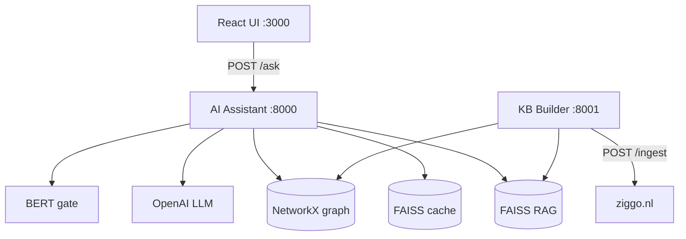

# VodafoneZiggo RAG Assistant

Customer-facing AI assistant for Ziggo product questions, built with **graph-augmented RAG**, **LangGraph** orchestration, a **Q&A cache**, and a **BERT security gate**.

## Documentation

| Doc | Purpose |
|-----|---------|
| [ARCHITECTURE.md](./ARCHITECTURE.md) | System design, data flows, graph schema, AWS target |
| [IMPLEMENTATION_PLAN.md](./IMPLEMENTATION_PLAN.md) | Phased build checklist with completion status |
| [services/kb-builder/INGEST_PIPELINE.md](./services/kb-builder/INGEST_PIPELINE.md) | KB ingest LangGraph nodes |
| [services/ai-assistant/QUERY_WORKFLOW.md](./services/ai-assistant/QUERY_WORKFLOW.md) | Query LangGraph nodes |
| [Technical_Assignment_Assist_Teams.md](./Technical_Assignment_Assist_Teams.md) | Original assignment brief |

## Quick start

```bash
# 1. Configure environment
cp .env.example .env
# Add OPENAI_API_KEY and LANGSMITH_API_KEY

# 2. Start all services
docker compose up --build

# 3. Verify
curl http://localhost:8000/health   # ai-assistant
curl http://localhost:8001/health   # kb-builder
curl http://localhost:8001/status   # KB stats (vectors, graph)

# 4. Ask a question
curl -X POST http://localhost:8000/ask \
  -H "Content-Type: application/json" \
  -d '{"question": "What is Ziggo GO?"}'

# 5. Chat UI
open http://localhost:3000
```

### First-time KB setup (if `data/` indexes are empty)

```bash
cd services/kb-builder
python3 -m venv .venv && source .venv/bin/activate
pip install -r requirements.txt

# Ingest all ziggo.nl product pages (~28 URLs, ~10 min + API cost)
DATA_DIR=../../data python scripts/run_ingest_all.py --ziggo-only \
  --report ../../data/ingest_report.json
```

## Current status

| Phase | Status | Notes |
|-------|--------|-------|
| 0 Scaffold | Done | Monorepo, Docker Compose, CDK skeleton |
| 1 Storage | Done | FAISS (RAG + cache), NetworkX graph |
| 2 KB ingest | Done | LangGraph pipeline, scrape → LLM → index |
| 3 Query RAG | Done | Graph-augmented retrieval + generation |
| 4 Q&A cache | Done | Separate FAISS index, seed + auto-write |
| 5 BERT gate | Done | toxic-bert + zero-shot off-topic |
| 6 Multi-page KB | Done | 30 pages ingested via batch script |
| 7 React UI | Done | Chat with source badges (cache/rag/blocked) |
| 8 Docker polish | Partial | Healthchecks; no ingest profile yet |
| 9 AWS CDK | Stub | Stacks synth; no real resources |
| 10 Docs | Done | This pass |

**KB snapshot** (after batch ingest): ~353 vector chunks, ~1004 graph nodes, ~1732 edges across 30 ziggo.nl pages.

## Architecture overview



### Query path (AI Assistant)

```
embed → cache_lookup → security_classify → vector_retrieve
  → graph_expand → generate_answer → maybe_cache → response
```

### Ingest path (KB Builder)

```
resolve → fetch → clean → parse → chunk → build_graph
  → llm_extract → llm_summarize → index_kb → persist
```

## Repository structure

```
vziggo-rag/
├── apps/web/                  # React chat UI
├── infra/                     # AWS CDK (stub stacks)
├── services/
│   ├── ai-assistant/          # Query: cache → BERT → graph RAG
│   └── kb-builder/            # Ingest: scrape → graph → embed
├── data/                      # Shared FAISS + NetworkX + page snapshots
│   ├── rag.faiss              # RAG vector index
│   ├── cache.faiss            # Q&A cache index
│   ├── graph.json             # Knowledge graph
│   ├── pages/                 # Per-page ingest JSON snapshots
│   └── qa_cache_seed.json     # Seed Q&As for cache demo
├── docker-compose.yml
└── turbo.json
```

## Technology choices

| Component | Choice | Why |
|-----------|--------|-----|
| Embeddings | OpenAI `text-embedding-3-small` | Quality/cost; same model for RAG + cache |
| LLM | Configurable (`LLM_MODEL` env) | Answer generation |
| Vector store (local) | FAISS `IndexFlatIP` | Fast cosine search, serializable |
| Graph (local) | NetworkX | Page → Section → Chunk → Entity structure |
| Ingest orchestration | LangGraph | Deterministic + LLM nodes, LangSmith traces |
| Query orchestration | LangGraph | Cache → security → RAG with conditional edges |
| Security | `unitary/toxic-bert` + DistilBERT zero-shot | Block toxic/off-topic before RAG |
| Observability | LangSmith | Trace both ingest and query graphs |
| IaC | AWS CDK (TypeScript) | Illustrative AWS deployment (not deployed) |

## Environment variables

See [`.env.example`](./.env.example). Key settings:

| Variable | Default | Purpose |
|----------|---------|-------|
| `OPENAI_API_KEY` | — | Embeddings + LLM |
| `LANGSMITH_TRACING` | — | Enable LangSmith (`true`) |
| `EMBEDDING_MODEL` | `text-embedding-3-small` | Shared by RAG + cache |
| `LLM_MODEL` | — | Answer generation model |
| `RAG_SIMILARITY_THRESHOLD` | `0.65` | Min chunk relevance score |
| `CACHE_SIMILARITY_THRESHOLD` | `0.92` | Min score for cache hit |
| `SECURITY_ENABLED` | `true` | BERT gate on/off |
| `DATA_DIR` | `/app/data` | Shared storage volume |

## Useful scripts

```bash
# KB Builder (from services/kb-builder, venv active)
DATA_DIR=../../data python scripts/run_ingest_all.py --ziggo-only   # batch ingest
DATA_DIR=../../data python scripts/run_ingest_sample.py --label "Ziggo GO"
DATA_DIR=../../data python scripts/smoke_storage.py                 # test FAISS + graph

# AI Assistant (from services/ai-assistant)
DATA_DIR=../../data python scripts/smoke_ask.py
DATA_DIR=../../data python scripts/smoke_cache_security.py

# Product nav extraction (from services/kb-builder)
python scripts/extract_product_nav.py   # → ziggo-product-label-urls.json
```

## Assignment deliverables

| Deliverable | Location |
|-------------|----------|
| Python source + comments | `services/ai-assistant/`, `services/kb-builder/` |
| LangGraph workflows | `app/graph/workflow.py` (query), `app/pipeline/graph.py` (ingest) |
| Dockerfile + compose | `services/*/Dockerfile`, `docker-compose.yml` |
| README | This file |
| Architecture diagrams | [ARCHITECTURE.md](./ARCHITECTURE.md) |
| AWS representation | `infra/`, ARCHITECTURE §10 |

## Development (without Docker)

```bash
# AI Assistant
cd services/ai-assistant && python3 -m venv .venv && source .venv/bin/activate
pip install -r requirements.txt
DATA_DIR=../../data uvicorn app.main:app --reload --port 8000

# KB Builder
cd services/kb-builder && python3 -m venv .venv && source .venv/bin/activate
pip install -r requirements.txt
DATA_DIR=../../data uvicorn app.main:app --reload --port 8001

# Web UI
cd apps/web && npm install && npm run dev

# CDK synth
cd infra && npm install && npm run synth
```

## Known limitations

- **JS-heavy pages** (e.g. `/tv-internet`) return sparse static HTML; pricing tables need Playwright for full extraction.
- **BERT models** download ~500MB on first request when `SECURITY_ENABLED=true`.
- **CDK stacks** are stubs — `cdk synth` works but nothing is deployed.
- **Cross-page `RELATED_TO` entity edges** not yet implemented (future enhancement).
