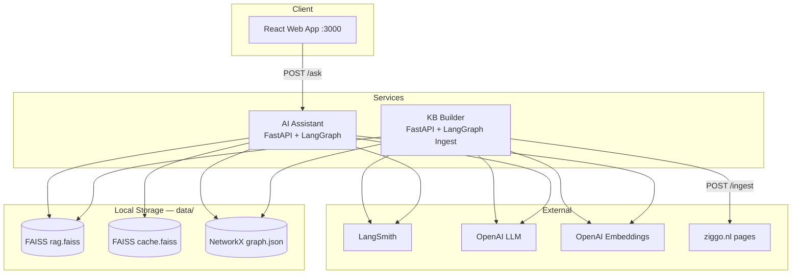
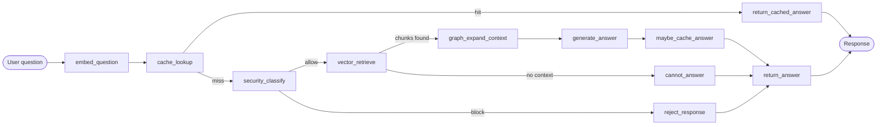
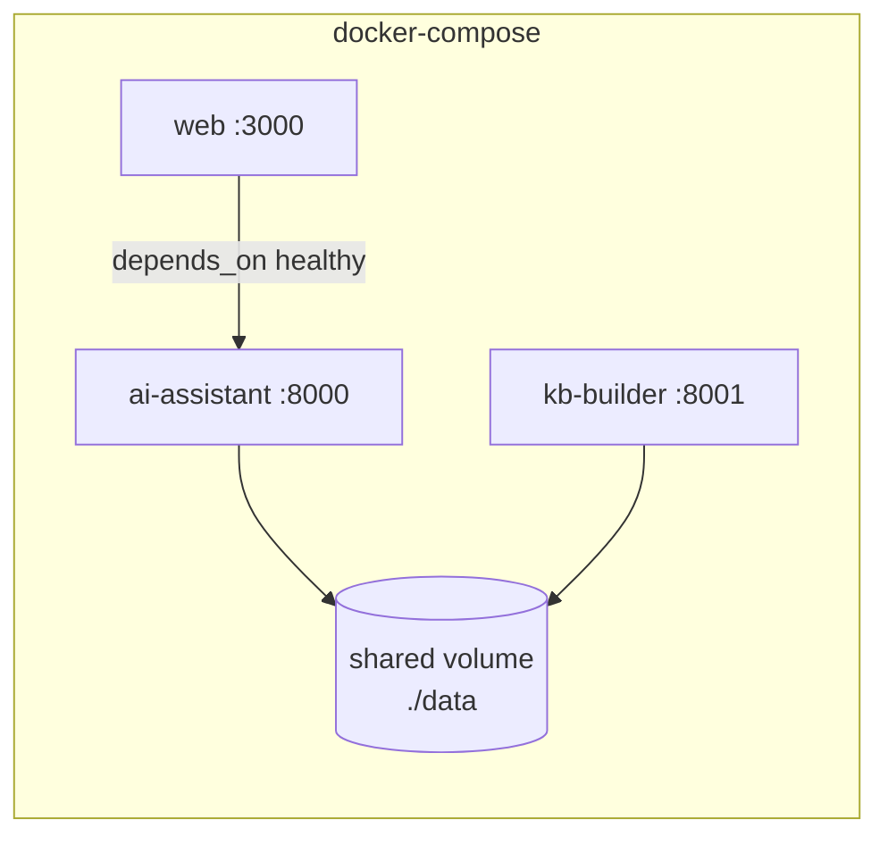
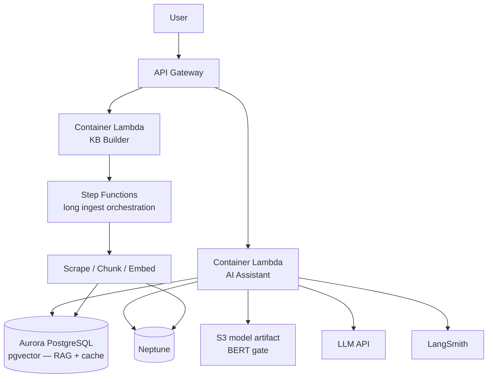

# Architecture — VodafoneZiggo RAG Assistant

This document describes the system architecture for the Ziggo customer-facing AI assistant. It covers the local development setup, service boundaries, data stores, LangGraph workflows, and the target AWS deployment model.

## 1. Goals

| Goal | How we address it |
|------|-------------------|
| Assignment requirements | RAG over Ziggo web content, LangGraph orchestration, FastAPI, Docker Compose |
| Graph RAG showcase | Knowledge graph models page structure, sections, chunks, and entities |
| Enterprise architecture | CDK stacks, dual-service design, clear local → AWS storage swap |
| Cost & safety | Separate Q&A cache index; BERT gate before expensive RAG path |
| Knowledge engineering | KB-builder with per-page re-ingest and heading-aware graph structure |

## 2. High-level system view



**Current KB scale** (after batch ingest of 30 ziggo.nl pages): ~353 vector chunks, ~1004 graph nodes, ~1732 edges. See `data/ingest_report.json`.

## 3. Repository layout

```
vziggo-rag/
├── apps/
│   └── web/                    # React chat UI (local testing)
├── infra/                      # AWS CDK (synth only — no deploy required)
├── services/
│   ├── ai-assistant/           # Query path: cache → security → RAG
│   │   ├── app/
│   │   │   ├── main.py         # FastAPI + /ask
│   │   │   ├── config.py
│   │   │   ├── graph.py        # LangGraph wiring
│   │   │   ├── nodes.py        # All query nodes
│   │   │   ├── cache/          # Q&A cache seed + lookup
│   │   │   ├── llm/            # Chat model + prompts
│   │   │   └── security/       # BERT gate
│   │   ├── scripts/            # smoke_ask, smoke_cache_security, download_hf_models
│   │   └── QUERY_WORKFLOW.md
│   └── kb-builder/             # Write path: scrape → structure → embed
│       ├── app/
│       │   ├── api/
│       │   ├── pipeline/       # LangGraph ingest workflow + nodes/
│       │   ├── scrape/         # fetch + clean
│       │   ├── structure/      # DOM → sections
│       │   ├── chunk/          # section-aware chunking
│       │   └── llm/            # entity extraction + summarization
│       ├── scripts/            # run_ingest_all, run_ingest_sample, extract_product_nav
│       └── INGEST_PIPELINE.md
├── packages/
│   ├── kb-store/               # Shared FAISS + NetworkX + OpenAI embeddings
│   └── api-contracts/          # Optional: shared API types for web
├── data/                       # Serialized FAISS indexes + graph + page snapshots
│   ├── rag.faiss, rag_meta.json, rag_vectors.npy
│   ├── cache.faiss, cache_meta.json, cache_vectors.npy
│   ├── graph.json
│   ├── pages/{page_id}.json
│   ├── qa_cache_seed.json
│   ├── ziggo-product-label-urls.json
│   └── ingest_report.json
├── docker-compose.yml
├── turbo.json                  # Orchestrates infra + web (not Python)
├── ARCHITECTURE.md
├── IMPLEMENTATION_PLAN.md
└── README.md
```

**Orchestration split**

- **Turborepo** — `infra/` CDK build/synth, `apps/web` lint/build.
- **Docker Compose** — Python services, shared volumes for `data/`, inter-service networking.

## 4. Services

### 4.1 AI Assistant (query path)

**Responsibility:** Accept customer questions, apply cache and security checks, run graph-augmented RAG, return answers.

| Endpoint | Method | Description |
|----------|--------|-------------|
| `/ask` | POST | Question in → answer out (JSON) |
| `/health` | GET | Liveness check |

**LangGraph workflow nodes**



| Node | Input | Processing | Output |
|------|-------|------------|--------|
| `embed_question` | User question string | Embed via embedding model | Question vector |
| `cache_lookup` | Question vector | Similarity search in **cache index** (separate FAISS) | Cache hit + answer, or miss |
| `security_classify` | User question | toxic-bert + zero-shot topic check | `allow` \| `block` + reason |
| `vector_retrieve` | Question vector | Top-k similarity in **RAG index** | Chunk IDs + scores |
| `graph_expand_context` | Chunk IDs | NetworkX traversal: parent section, entities, adjacent chunks | Enriched context set |
| `generate_answer` | Question + context | LLM with system prompt (tone, safety, cite context) | Draft answer |
| `maybe_cache_answer` | Question, answer, confidence | Write to cache if confidence ≥ threshold | Updated cache (optional) |
| `cannot_answer` | Empty retrieval | Polite "not in knowledge base" message | Draft answer, `source=none` |
| `return_cached_answer` | Cached record | Format customer-facing response | Final JSON |
| `reject_response` | Block reason | Safe refusal message | Final JSON, `blocked=true` |

**Low-confidence / empty retrieval**

- If `vector_retrieve` returns no chunks above `RAG_SIMILARITY_THRESHOLD` (default `0.65`) → route to `cannot_answer`, then `return_answer`.
- Optional future node: `reformulate_query` before a second retrieve attempt.

**Observability:** LangSmith traces every node transition and LLM call (`run_name: ziggo-ask`).

### 4.2 KB Builder (ingest path)

**Responsibility:** Scrape Ziggo pages, build graph structure, chunk, embed, persist to shared storage.

| Endpoint | Method | Description |
|----------|--------|-------------|
| `/ingest` | POST | Re-ingest a single page by URL or nav `label` |
| `/status` | GET | Ingested page list + vector/graph store stats |
| `/health` | GET | Liveness check |

Batch ingest is via CLI script `scripts/run_ingest_all.py` (not a separate HTTP endpoint).

**LangGraph ingest pipeline**

```mermaid
flowchart LR
  START([page_url or label]) --> RESOLVE[resolve]
  RESOLVE --> FETCH[fetch]
  FETCH --> CLEAN[clean]
  CLEAN --> PARSE[parse_sections]
  PARSE --> CHUNK[chunk]
  CHUNK --> GRAPH[build_graph]
  GRAPH --> LLM_E[llm_extract]
  LLM_E --> LLM_S[llm_summarize]
  LLM_S --> INDEX[index_kb]
  INDEX --> PERSIST[persist]
  PERSIST --> DONE([Done])
```



| Node | Type | Description |
|------|------|-------------|
| `resolve` | deterministic | Map nav label → URL via `ziggo-product-label-urls.json` |
| `fetch` | deterministic | `requests` GET |
| `clean` | deterministic | Strip nav/footer; flag `rich` vs `sparse` content |
| `parse_sections` | deterministic | h1–h4 sections, or sparse-page overview fallback |
| `chunk` | deterministic | Section-aware chunking |
| `build_graph` | deterministic | Page → Section → Chunk + NEXT edges |
| `llm_extract` | LLM | Entity extraction → Entity + MENTIONS edges |
| `llm_summarize` | LLM | Section topic + summary on Section nodes |
| `index_kb` | deterministic | Embed chunks → FAISS; save graph |
| `persist` | deterministic | Write `data/pages/{page_id}.json` snapshot |

**Re-ingest semantics**

- Each page has a stable `page_id` (derived from URL).
- Re-ingest **replaces** the page subgraph and associated chunk vectors (delete-then-insert).
- Other pages in the KB are untouched.

**Source scope:** 30 ziggo.nl product/service pages ingested from `data/ziggo-product-label-urls.json`. JS-heavy pricing pages fall back to sparse og/meta overview.

## 5. Knowledge graph schema

NetworkX locally; Amazon Neptune (Gremlin) in AWS — both behind a `GraphStore` interface.

### 5.1 Node types

| Label | Key properties | Description |
|-------|----------------|-------------|
| `Page` | `page_id`, `url`, `title`, `scraped_at` | One scraped ziggo.nl page |
| `Section` | `section_id`, `heading`, `level`, `summary` | DOM heading block (h1–h4) |
| `Chunk` | `chunk_id`, `text`, `token_count` | Retrieval unit within a section |
| `Entity` | `entity_id`, `name`, `type` | Product/feature mention (e.g. "Ziggo GO") |

### 5.2 Edge types

| Edge | From → To | Purpose |
|------|-----------|---------|
| `HAS_SECTION` | Page → Section | Page structure |
| `HAS_CHUNK` | Section → Chunk | Section contains chunks |
| `NEXT` | Chunk → Chunk | Reading order within section |
| `MENTIONS` | Chunk → Entity | Entity extraction link |
| `RELATED_TO` | Entity → Entity | Cross-page relationships *(not yet implemented)* |

### 5.3 Graph-augmented retrieval

1. Vector search returns top-k `Chunk` nodes.
2. Graph expansion adds:
   - Parent `Section` (heading + LLM summary context)
   - `NEXT` adjacent chunks (continuity)
   - `MENTIONS` → entities (cross-link context)
3. Dedupe, rank by relevance, trim to context window budget.

## 6. Storage layer

### 6.1 Implementations

Concrete classes live in `packages/kb-store` (`kb_store`) — one package imported by both Python services so vector/graph code is not duplicated. Both FastAPI apps load the stores in their **lifespan** (process-wide singleton via `get_knowledge_base()`).

| Class | Files | Purpose |
|-------|-------|---------|
| `FaissVectorStore` | `rag.faiss`, `rag_meta.json`, `rag_vectors.npy` | RAG chunk index |
| `FaissCacheStore` | `cache.faiss`, `cache_meta.json`, `cache_vectors.npy` | Q&A cache index |
| `NetworkXGraphStore` | `graph.json` | Knowledge graph (node-link JSON) |
| `KnowledgeBase` | facade in `kb_store/kb.py` | Unified read/write API |

### 6.2 Local vs AWS

| Concern | Local | AWS |
|---------|-------|-----|
| RAG vectors | FAISS (`data/rag.faiss`) | Aurora PostgreSQL + pgvector |
| Q&A cache | Separate FAISS (`data/cache.faiss`) | Aurora pgvector (separate table) |
| Knowledge graph | NetworkX → `data/graph.json` | Amazon Neptune |
| Graph queries | NetworkX traversal | Gremlin (same `GraphStore` contract) |
| LLM / embeddings | OpenAI (env-configured) | Same providers via VPC endpoints / secrets |
| Observability | LangSmith | LangSmith (env vars in Lambda/ECS) |

### 6.3 Committed data

- `data/` holds serialized indexes, graph, page snapshots, and seed Q&As for clone-and-run.
- Regenerate via `POST /ingest` or `scripts/run_ingest_all.py`.
- Large binaries may be gitignored; document ingest steps in README.

## 7. Cache index design

**Why separate from RAG index**

- Different lifecycle (Q&A pairs vs document chunks).
- Different similarity thresholds and TTL policies.
- Avoids polluting retrieval context with past answers.

**Cache record**

```json
{
  "question": "What is Ziggo GO?",
  "answer": "...",
  "embedding": [...],
  "created_at": "ISO-8601",
  "source": "auto | seed"
}
```

**Lookup:** cosine similarity ≥ `CACHE_SIMILARITY_THRESHOLD` (default `0.92`) → return cached answer without LLM call.

**Seed data:** 10 canonical Q&As in `data/qa_cache_seed.json` (NL + EN).

**Write-back:** `maybe_cache_answer` stores high-confidence RAG answers when `CACHE_AUTO_WRITE=true` and confidence ≥ `CACHE_MIN_WRITE_CONFIDENCE`.

## 8. Security gate (BERT)

**Role:** Route before expensive RAG — not a replacement for LLM safety.

| Label | Model | Action |
|-------|-------|--------|
| `allow` | — | Continue to RAG |
| `off_topic` | `typeform/distilbert-base-uncased-mnli` (zero-shot) | Polite refusal |
| `toxic` | `unitary/toxic-bert` | Block with safe message |

Toggle with `SECURITY_ENABLED=false` for fast local dev (skips loading ~500MB of weights). Docker images download the models at **build** time into `HF_HOME=/models`.

**AWS:** model artifact in S3, loaded in container Lambda cold start; SageMaker endpoint noted as production alternative in README.

## 9. Local runtime (Docker Compose)



- Both Python services mount `./data` read/write.
- Compose build context is the **repo root** so images can `pip install packages/kb-store`.
- KB-builder writes indexes; AI-assistant reads them (restart after ingest if needed — in-memory FAISS is loaded once at lifespan).
- Web app calls `ai-assistant` directly (`VITE_API_URL`).

## 10. AWS target architecture (CDK — illustrative)



### 10.1 CDK stack split (`infra/`)

| Stack | Resources | Status |
|-------|-----------|--------|
| `NetworkStack` | VPC, subnets, security groups | Stub |
| `DataStack` | Aurora (pgvector), Neptune cluster | Stub |
| `ApiStack` | API Gateway, AI-assistant Lambda, KB-builder Lambda | Stub |
| `IngestStack` | Step Functions state machine, EventBridge schedule | Stub |

`cdk synth` succeeds; no resources deployed.

### 10.2 Security considerations (AWS)

- API Gateway: throttling, API keys or Cognito for demo; WAF for production.
- Secrets Manager for LLM/embedding API keys.
- Aurora and Neptune in private subnets; Lambda in VPC with least-privilege SGs.
- S3 bucket policies for model artifacts and ingest staging.
- No PII stored in cache without retention policy (document in README).

## 11. Technology choices

| Component | Choice | Rationale |
|-----------|--------|-----------|
| Embeddings | OpenAI `text-embedding-3-small` (1536-d) | Quality/cost balance; shared by RAG + cache; native dim keeps existing FAISS indexes valid |
| LLM | Configurable via `LLM_MODEL` | Answer generation |
| Vector store (local) | FAISS IndexFlatIP | Fast, no extra service, easy serialize to `data/` |
| Vector store (AWS) | Aurora pgvector | Managed, SQL ecosystem, dual table for RAG + cache |
| Graph (local) | NetworkX | Simple, serializable, fast iteration |
| Graph (AWS) | Neptune | Managed graph, Gremlin, fits entity/structure model |
| Ingest orchestration | LangGraph | Same framework as query; LangSmith traces |
| Query orchestration | LangGraph | Assignment requirement; explicit node/edge observability |
| API | FastAPI | Async, OpenAPI docs, lightweight |
| Frontend | React + Vite | Local chat testing |
| IaC | AWS CDK (TypeScript) | Enterprise showcase; matches turbo infra pipeline |
| Observability | LangSmith | First-class LangGraph tracing |

## 12. API contracts (summary)

### POST `/ask` (AI Assistant)

**Request**
```json
{ "question": "What TV packages does Ziggo offer?" }
```

**Response**
```json
{
  "answer": "...",
  "source": "cache | rag | none",
  "confidence": 0.95,
  "blocked": false
}
```

### POST `/ingest` (KB Builder)

**Request** (URL or nav label)
```json
{ "page_url": "https://www.ziggo.nl/internet" }
```
```json
{ "label": "Ziggo GO" }
```

**Response**
```json
{
  "page_id": "internet",
  "chunks_count": 42,
  "entities_extracted": 8,
  "vectors_indexed": 42,
  "status": "completed"
}
```

### GET `/status` (KB Builder)

```json
{
  "pages": [{ "page_id": "ziggo-go", "artifact": "ziggo-go.json" }],
  "store": {
    "vector_chunks": 353,
    "graph_nodes": 1004,
    "graph_edges": 1732,
    "embedding_model": "text-embedding-3-small"
  }
}
```

---

*See [IMPLEMENTATION_PLAN.md](./IMPLEMENTATION_PLAN.md) for phased build order and completion status.*
